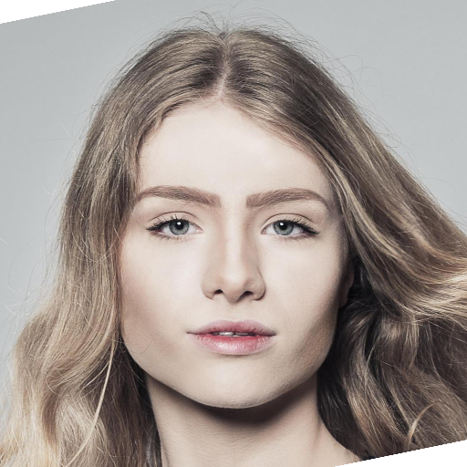
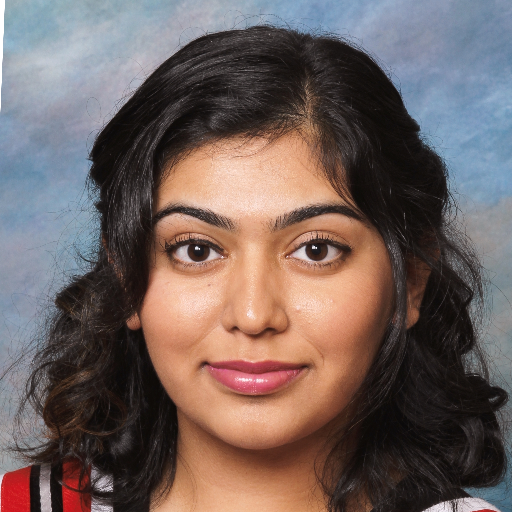
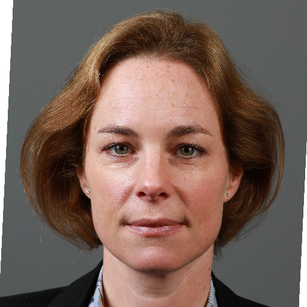
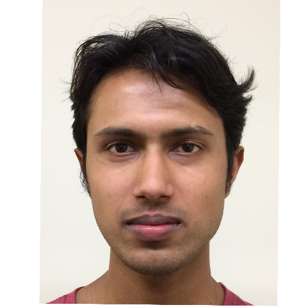
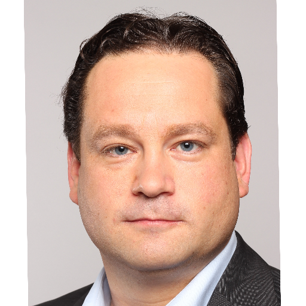
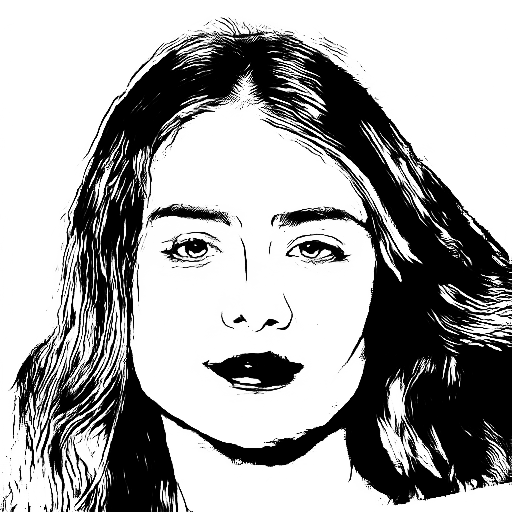
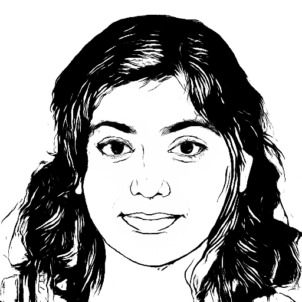
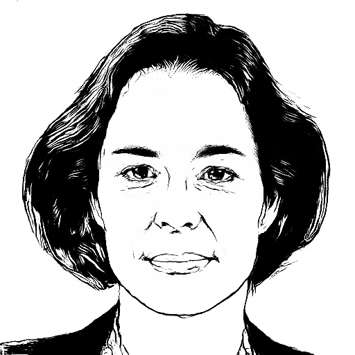
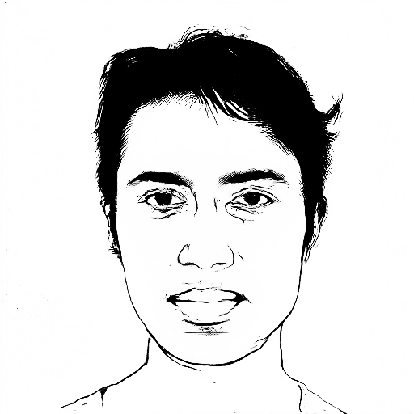
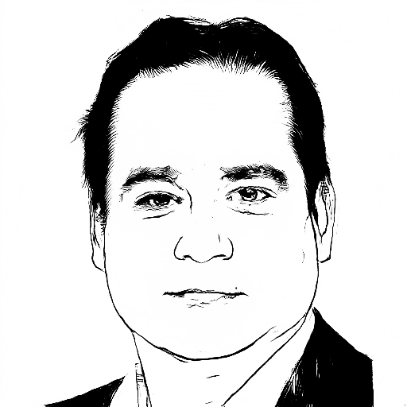

# APDrawingGAN Jittor Implementation

We provide [Jittor](https://github.com/Jittor/jittor) implementations for our CVPR 2019 oral paper "APDrawingGAN: Generating Artistic Portrait Drawings from Face Photos with Hierarchical GANs". [[Paper]](http://openaccess.thecvf.com/content_CVPR_2019/html/Yi_APDrawingGAN_Generating_Artistic_Portrait_Drawings_From_Face_Photos_With_Hierarchical_CVPR_2019_paper.html)

This project generates artistic portrait drawings from face photos using a GAN-based model.

## Prerequisites
- Linux or macOS
- Python 3
- CPU or NVIDIA GPU + CUDA CuDNN

## Sample Results
Up: input, Down: output
<p>
    
    
    
    
    
</p>
<p>
    
    
    
    
    
</p>

## Installation
- To install the dependencies, run
```bash
pip install -r requirements.txt
```

## Apply pretrained model

- 1. Download pre-trained models from [BaiduYun](https://pan.baidu.com/s/1ZTyV4gpMU45tp4d-bLwfmQ)(extract code: 9qhp) and rename the folder to `checkpoints`.

- 2. Test for example photos: generate artistic portrait drawings for example photos in the folder `./samples/A/example` using models in `checkpoints/formal_author`
``` bash
python test.py
```
Results are saved in `./results/portrait_drawing/formal_author_300/example`

- 3. To test on your own photos: First run preprocess [here](preprocess/readme.md)). Then specify the folder that contains test photos using option `--input_folder`, specify the folder of landmarks using `--lm_folder` and the folder of masks using `--mask_folder`, and run the `test.py` again.

## Train

- 1. Download the APDrawing dataset from [GoogleDrive](https://drive.google.com/file/d/1vm8uwNcy113f-TZmRtgh_H4djNEaLXvO/view?usp=sharing) and put the folder to `data/apdrawing`.

- 2. Train our model (300 epochs)
``` bash
python apdrawing_gan.py
```
Models are saved in folder `checkpoints/apdrawing`

- 4. Test the trained model
``` bash
python test.py --which_epoch 300 --model_name apdrawing
```
Results are saved in `./results/portrait_drawing/apdrawing_300/example`

## Citation
If you use this code or APDrawing dataset for your research, please cite our paper.

```
@inproceedings{YiLLR19,
  title     = {{APDrawingGAN}: Generating Artistic Portrait Drawings from Face Photos with Hierarchical GANs},
  author    = {Yi, Ran and Liu, Yong-Jin and Lai, Yu-Kun and Rosin, Paul L},
  booktitle = {{IEEE} Conference on Computer Vision and Pattern Recognition (CVPR '19)},
  pages     = {10743--10752},
  year      = {2019}
}
```